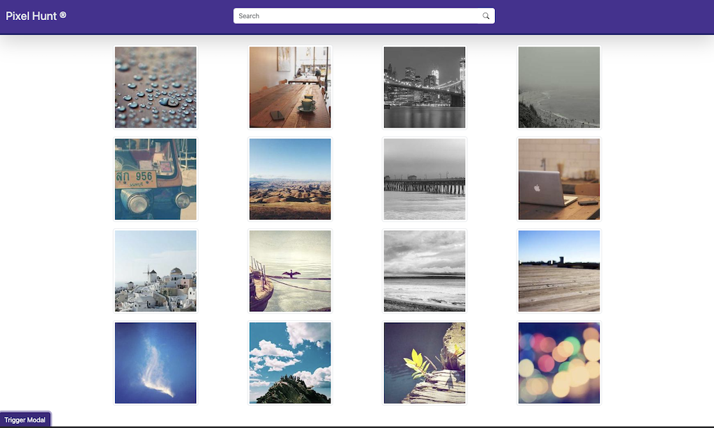

# Pixel Hunt ®

[](https://goit-react-hw-04-levent.vercel.app/)

## Project Description

Pixel Hunt is an application that allows users to search for images using keywords. By utilizing the Unsplash API, you can instantly find and view images based on your search query. You can explore the gallery, and view detailed information about each image in a modal window.

This project was developed using **Vite** and utilizes **React**'s modern features. The user-friendly interface makes image search easy and intuitive.

---

## Technologies Used

- **React** - For managing UI components
- **Vite** - For fast development workflow
- **Axios** - For making HTTP requests
- **React Hot Toast** - For user notifications
- **React Modal** - For displaying modal windows
- **React Loader Spinner** - For displaying loading indicators
- **Sass** - For managing CSS styles
- **Bootstrap** - For rapid and responsive design

---

## How to Install?

To run the project locally, follow these steps:

1. **Clone the repository:**

   ```bash
   git clone https://github.com/leventkoybasi/goit-react-hw-04.git
   ```

2. **Install dependencies:**

   ```bash
   cd goit-react-hw-04
   npm install
   ```

3. **Start the development server:**

   ```bash
   npm run dev
   ```

   This will start the project locally and you can view it at [http://localhost:3000](http://localhost:3000).

---

## Project Features

- **Keyword-Based Image Search:** Search for images based on keywords using the Unsplash API.
- **Image Gallery:** View the images you have uploaded in a gallery format.
- **Modal Window:** When you click on an image, you can see the larger version and related information in a modal window.
- **Loading Indicator:** A loading spinner will be shown while the images are being loaded.
- **Error Handling:** If an HTTP request fails, an error message will be shown to the user.
- **Load More Button:** Users can click a button to load more images.

---

## Demo

## You can access the live demo of the project [here](https://goit-react-hw-04-levent.vercel.app/).

## Contributing

If you'd like to contribute to this project, follow these steps:

1. **Fork** the repository and create your own copy.
2. **Create a new branch** (`git checkout -b feature/your-feature`).
3. Commit your changes (`git commit -am 'Add new feature'`).
4. **Create a pull request**.

---

## Contact

If you have any questions or suggestions, feel free to contact me:

- GitHub: [https://github.com/leventkoybasi](https://github.com/leventkoybasi)
- Email: leventkoybasi@hotmail.com
